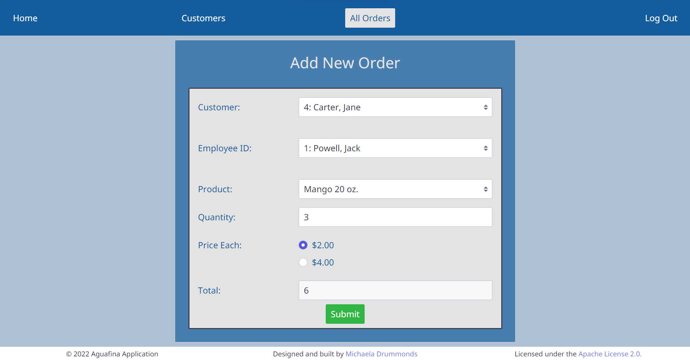
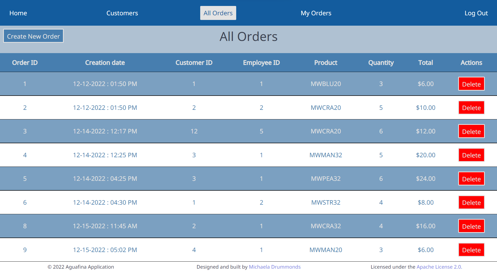

# Aguafina App
<b><em>Description</em></b> 

Aguafina App is a web application used by customers and employees of a mineral water store, Aguafina. Customers use Aguafina App to view their order history and update their personal information. Employees use the app to view their order history as well as add new orders, view all past orders of the store, and look up customers. Employees with an admin role can delete orders.

<b><em>Tech Stack:</em></b>

Front End: 
<ul>
  <li>HTML</li>
  <li>CSS</li>
  <li>Javascript</li>
 </ul>

Back End: 
<ul>
  <li>Java</li>
  <li>MySQL</li>
</ul>

Frameworks: 
<ul>
  <li>Spectre.css</li>
  <li>Spring MVC</li>
</ul>

Template Engine: 
<ul>
  <li>Thymeleaf</li>
</ul>

<b><em>Demo:</em></b> 

<figure>
  <figcaption><b>Database Schema</b></figcaption> 
  
</figure>
Many to Many Relationship:
<ul>
  <li>Users and Roles</li>
</ul>

Many to One Relationships:
<ul>
  <li>Customers to Users</li>
  <li>Employees to Users</li>
  <li>Orders to Customers</li>
  <li>Orders to Employees</li>
</ul>

<h3><b>All Users</b></h3>

<figure>
  <figcaption><b>Login Page</b></figcaption>
  
</figure>
Both customers and employees use this login page to enter the app. If they are a new user, the customer/employee can register an account using either the customer user account registration page or the employee user account registration page. 

<h3><b>Customer User:</b></h3>
<figure>
  <figcaption><b>Customer Home page</b></figcaption>
  
</figure>
After successfully logging in, the customer is brought to the home page and chooses one of the available options.
 
<figure>
  <figcaption><b>View My Orders</b></figcaption>
  
</figure>
 
The customer is able to see their personal information, past orders, and grand total of all orders.
 
<figure>
  <figcaption><b>Update My Information</b></figcaption>
  
</figure>
Here, the customer can update their personal information.
 

<h3>Employee User:</h3>
<figure>
  <figcaption><b>Employee Home Page</b></figcaption>
  
</figure>
After successfully logging in, the employee is brought to the home page and chooses one of the available options.
 
<figure>
  <figcaption><b>View My Orders</b></figcaption>
  
</figure>
Similar to the customer's "View My Orders Page", an employee can see their personal information, completed orders, and total number of orders.
 
<figure>
  <figcaption><b>Add New Order</b></figcaption>
  
</figure>
Here, the employee can add a new order for an existing customer. If the customer is new, the employee can add the new customer to the database and then continue to add a new order.
 
<figure>
  <figcaption><b>View All Orders</b></figcaption>
  
</figure>
All orders completed by all employees are shown on the orders page. Admin employee users can delete orders if needed.
 
<figure>
  <figcaption><b>Customers</b></figcaption>
  
</figure>
All existing customers are listed on the customers page. Employees can also find customers by their email or phone number.
 
<b><em>Blockers:</em></b>
<dl>
<dt>Unit Testing</dt>
<dd>I had some issues with matching up sample database data and csv source data as well as empty result errors.</dd>
<dt>Thymeleaf Syntax</dt>
<dd>JSP is similar in some aspects to Thymeleaf but not completely, especially with form validation. I had to learn new thymeleaf syntax for some pages.</dd>
<dt>Building the database schema in MYSQL</dt>
<dd>At first I tried to set up the database and tables in MySQL, but it was difficult with multiple foreign keys. It is easier to build the tables using Hibernate and using SQL scripts to insert sample data.</dd>
</dl>
